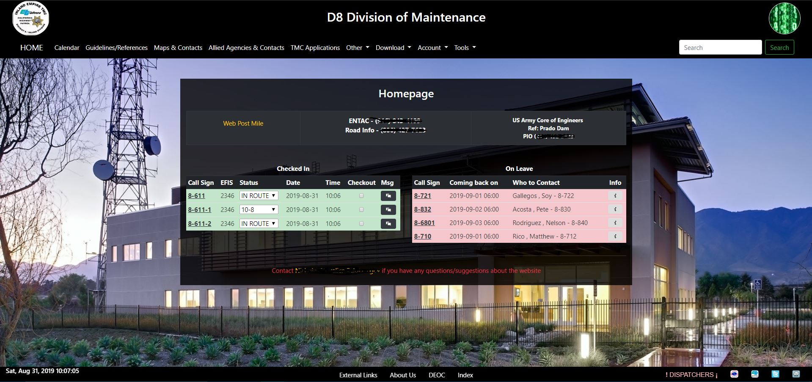

# Dispatcher Summer Project

I will be creating a website for Dispatchers to display crew information connected through a database as well as added functionality to display which crews are on duty while keeping records of crews on leave. 

Homepage

The left column is a list people who are currently on duty, while the right column is a list of people who are on vacation/leave. Users who are not logged in are not allowed to checkout, change status or edit messages of the people on duty.

Maps and Contacts Page (logged in users)

This is the maps and contacts page for users who are logged in, they are allowed to edit, delete and view personal and alternate phone numbers. 

Maps and Contacts Page (non users)

This is the maps and contacts page for non users, non users cannot edit/delete anything on the page or view personal and alternate numbers for crew workers.
